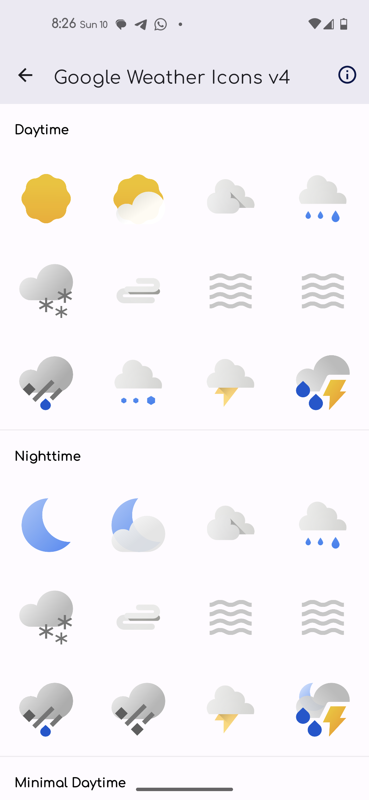
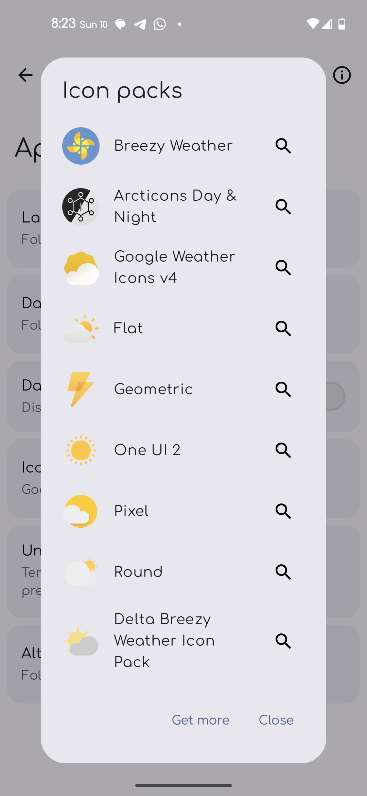
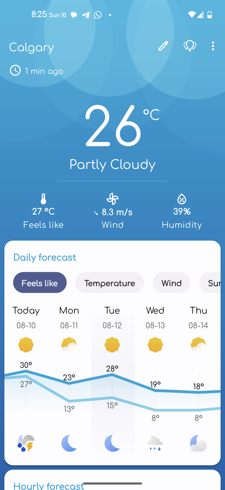
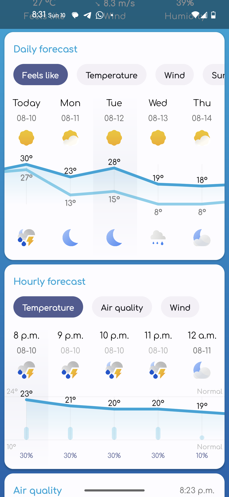

# Google Weather Icons v4 - Breezy Weather Icon Pack

A custom icon pack for [Breezy Weather](https://github.com/breezy-weather/breezy-weather) featuring Google's official Weather Icons v4 with clean, transparent backgrounds.



## Features

- ✅ **80+ weather icons** from Google Weather Icons v4
- ✅ **Day and night variants** for accurate weather representation
- ✅ **Transparent backgrounds** - no circular masks or backgrounds
- ✅ **High resolution** 512x512px PNG icons converted from original SVGs
- ✅ **Full compatibility** with Breezy Weather v5.4.8+
- ✅ **Clean integration** appears seamlessly in Breezy Weather settings

## Installation

### Method 1: Download APK
1. Go to [Releases](../../releases)
2. Download the latest `GoogleWeatherIconsV4Pack.apk`
3. Install the APK on your Android device
4. Open Breezy Weather → Settings → Appearance → Icon Packs
5. Select "Google Weather Icons v4"

### Method 2: Build from Source
1. Clone this repository
2. Open in Android Studio
3. Build → Build Bundle(s) / APK(s) → Build APK(s)
4. Install the generated APK

## Requirements

- Android 8.0+ (API level 26+)
- [Breezy Weather](https://github.com/breezy-weather/breezy-weather) app installed

## Screenshots

| Breezy Weather Settings | Icon Preview | Weather Display |
|------------------------|---------------|-----------------|
|  |  |  |

| Weather Display #2 |
|--------------------|
|  |

## Technical Details

- **Package name**: `com.matthew.googleweathericonsv4`
- **Target SDK**: Android API level 34
- **Architecture**: Uses ContentProvider pattern for icon pack integration
- **Icon format**: 512x512px PNG with transparent backgrounds
- **Integration method**: Dual ContentProvider + metadata approach

## Icon Coverage

This icon pack includes all major weather conditions with day/night variants:

**Clear & Sunny**
- Clear day/night, mostly clear day/night, partly cloudy day/night

**Cloudy**
- Cloudy, mostly cloudy day/night, broken clouds day/night

**Precipitation**
- Rain (light, heavy, showers), snow (light, heavy, blizzard), mixed precipitation, drizzle, sleet

**Severe Weather**
- Thunderstorms, severe thunderstorms, hurricanes, tornadoes, tropical storms

**Atmospheric Conditions**
- Fog, mist, haze, dust, sand, smoke, volcanic ash

**Special Conditions**
- Very hot, very cold, windy, squalls

## Development

### Project Structure
```
app/
├── src/main/
│   ├── java/com/matthew/googleweathericonsv4pack/
│   │   ├── MainActivity.kt
│   │   └── GoogleWeatherIconProvider.kt
│   ├── res/
│   │   ├── drawable/          # Weather icons (PNG)
│   │   ├── mipmap-*/          # App launcher icons
│   │   ├── values/
│   │   │   └── strings.xml
│   │   └── xml/
│   │       └── config.xml     # Icon pack configuration
│   └── AndroidManifest.xml
```

### Contributing

1. Fork the repository
2. Create a feature branch
3. Make your changes
4. Test with Breezy Weather
5. Submit a pull request

## Credits & Attribution

### Icons
- **Original Icons**: Google Weather Icons v4
- **Source**: [mrdarrengriffin/google-weather-icons](https://github.com/mrdarrengriffin/google-weather-icons)
- **License**: Creative Commons Attribution 4.0 License
- **Copyright**: © Google LLC. All rights reserved.

### Development
- **Icon Pack Development**: mbatthew
- **Breezy Weather Integration**: Based on [Breezy Weather Icon Pack standards](https://github.com/breezy-weather/breezy-weather-icon-packs)

### Special Thanks
- [Breezy Weather](https://github.com/breezy-weather/breezy-weather) team for the excellent weather app
- [mrdarrengriffin](https://github.com/mrdarrengriffin) for collecting and organizing the Google Weather Icons
- Google for creating the original weather icon designs

## License

This project is licensed under the MIT License - see the [LICENSE](LICENSE) file for details.

**Important**: The weather icons themselves are owned by Google and licensed under Creative Commons Attribution 4.0. This repository contains only the Android app wrapper that packages these icons for use with Breezy Weather.

## Disclaimer

This is an unofficial icon pack. Google Weather Icons are the property of Google LLC. This project is not affiliated with or endorsed by Google LLC or the Breezy Weather project.

## Support

- **Issues**: Report bugs or feature requests in the [Issues](../../issues) section
- **Breezy Weather Support**: Visit the [official Breezy Weather repository](https://github.com/breezy-weather/breezy-weather)

---

**Made with ❤️ for the Breezy Weather community**
